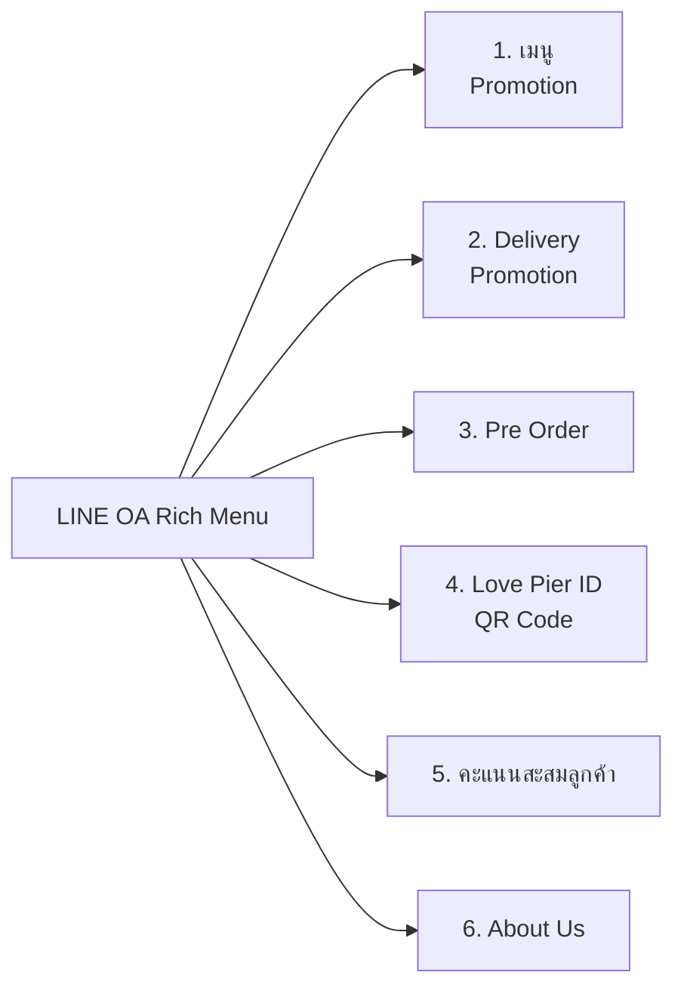
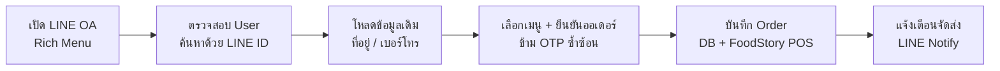
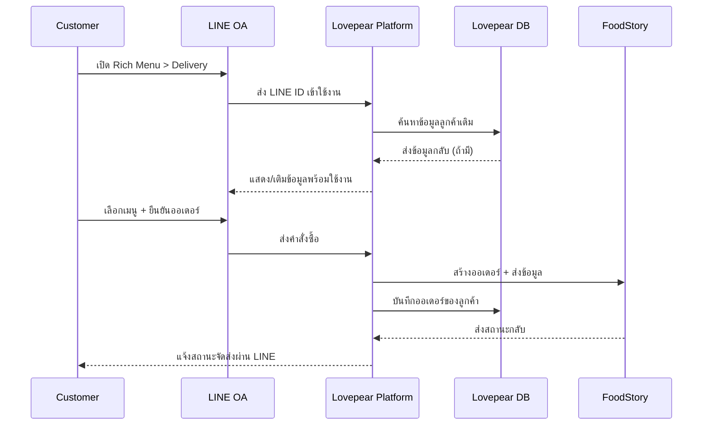
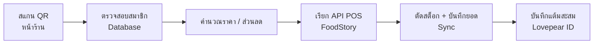
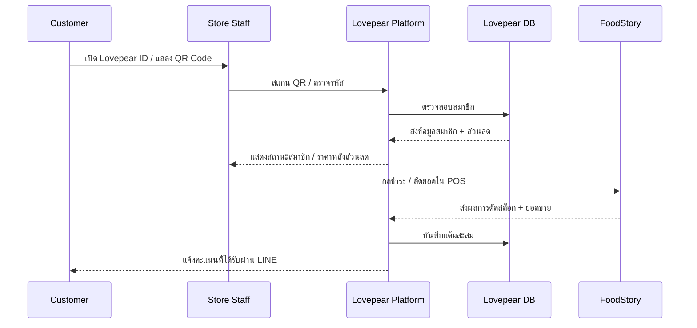
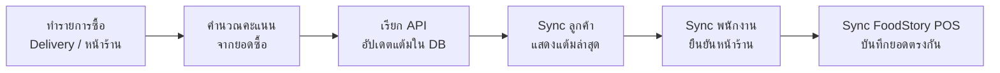
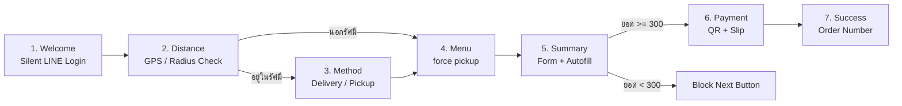
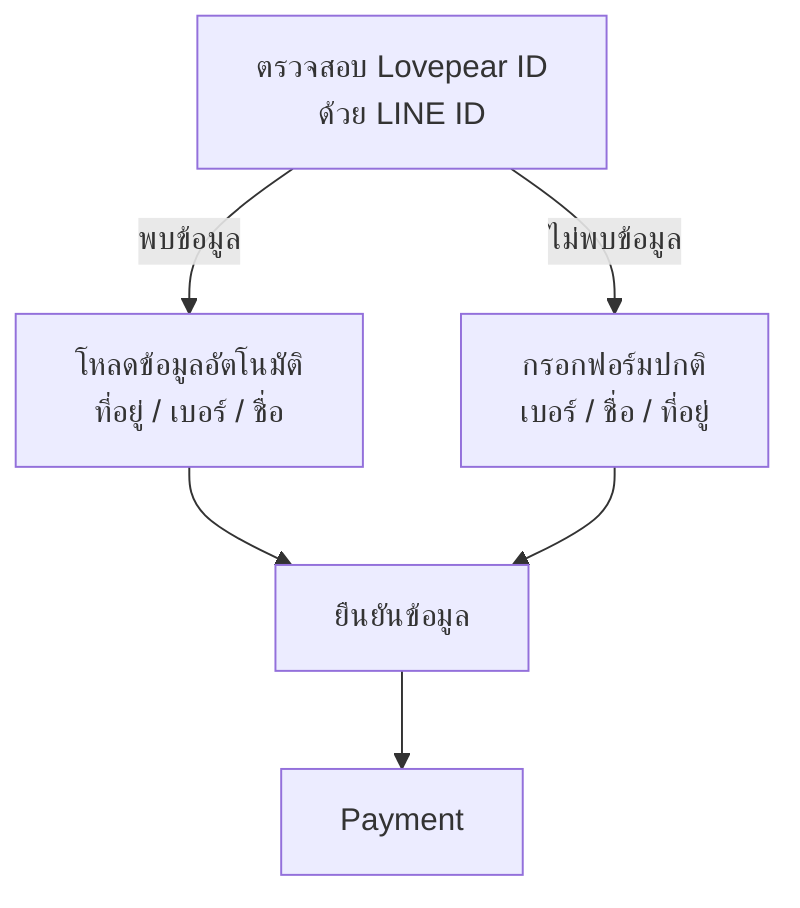
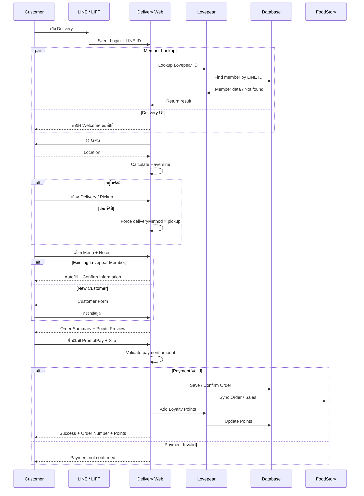

# Love Pier Delivery & Lovepear ID — Developer Flow Specification

> เอกสารสำหรับทีม Developer  
> แปลงจากเอกสาร **“สรุป Flow และ User Journey สำหรับปรับปรุงหน้า `/delivery` และระบบสมาชิก Lovepear ID”**  
> เนื้อหานี้จัดรูปแบบใหม่ให้อ่านง่ายสำหรับการพัฒนา โดยคง logic และข้อกำหนดจากเอกสารต้นฉบับ

---

## 1. LINE OA Rich Menu Structure

Rich Menu มีทั้งหมด **6 ปุ่มหลัก** และเป็นจุดเริ่มต้นของ Journey ต่าง ๆ

| # | Menu | Detail |
|---|---|---|
| 1 | เมนู | มี Promotion อยู่ด้านใน |
| 2 | Delivery | มี Promotion อยู่ด้านใน |
| 3 | Pre Order | สั่งล่วงหน้า |
| 4 | Love Pier ID | แสดง QR Code สำหรับยืนยันตัวตน / สแกนหน้าร้าน |
| 5 | คะแนนสะสมลูกค้า | ดูแต้มสะสมและสิทธิประโยชน์ |
| 6 | About Us | ที่มาที่ไปของร้าน รวมถึงมาตรฐานต่าง ๆ (Brand Commitment) |



---

# 2. Main User Journeys

เอกสารต้นฉบับแบ่ง Journey หลักออกเป็น 4 ส่วน:

1. LINE OA / Delivery Ordering
2. Lovepear ID — QR หน้าร้าน
3. Loyalty Points
4. Table Reservation

---

## 2.1 LINE OA / Delivery Ordering

### Technical Flow

1. เปิด LINE OA จาก Rich Menu
2. ตรวจสอบ User ด้วย `LINE ID` ในฐานข้อมูล
3. โหลดข้อมูลเดิมของลูกค้าเก่า
   - ที่อยู่
   - เบอร์โทร
4. เลือกเมนู + ยืนยันออเดอร์
   - ข้าม OTP ที่ซ้ำซ้อน
5. บันทึกออเดอร์
   - Database
   - FoodStory POS
6. แจ้งเตือนการจัดส่งผ่าน LINE Notify



### Roles / Systems

- Customer
- LINE OA
- Lovepear Platform
- Lovepear Database
- FoodStory

### Sequence



---

## 2.2 Lovepear ID — QR Scan at Store

### Technical Flow

1. พนักงานสแกน QR ของ Lovepear ID หน้าร้าน
2. ตรวจสอบสมาชิกใน Database
3. คำนวณราคา / ส่วนลด
   - ตัวอย่าง: ลด 10%
4. เรียก API ไป FoodStory POS
5. ตัดสต็อก + บันทึกยอด
   - sync ให้ข้อมูลตรงกันทุกจุด
6. บันทึกแต้มสะสมเข้า Lovepear ID



### Sequence



---

## 2.3 Loyalty Points

### Technical Flow

1. ลูกค้าทำรายการซื้อ
   - Delivery หรือหน้าร้าน
2. คำนวณคะแนนจากยอดซื้อ
3. เรียก API เพื่ออัปเดตแต้มใน DB
4. Sync ไปเครื่องลูกค้า
   - แสดงแต้มล่าสุด
5. Sync ไปเครื่องพนักงาน
   - ใช้ยืนยันหน้าร้าน
6. Sync กับ FoodStory POS
   - ยอดต้องตรงกัน



---

## 2.4 Table Reservation

### Technical Flow

1. ลูกค้ากรอกฟอร์มจอง
   - ชื่อ
   - เบอร์โทร
   - เวลา
   - ควรจบใน 1–2 ขั้นตอนสั้น ๆ
2. Validate ข้อมูลฟอร์ม
3. เช็คโต๊ะว่างตามช่วงเวลาที่จอง
4. บันทึกรายการลง Database
5. แจ้งเตือนร้านเมื่อมีการจองใหม่
6. แจ้งลูกค้าว่าการจองสำเร็จ


---

# 3. Current `/delivery` Flow

ปัจจุบันเป็น Full-screen wizard จำนวน **7 ขั้นตอน**

### Global Wizard Behavior

- ซ่อน `nav/footer` ตั้งแต่ Step 2 เป็นต้นไป
- เมื่อเปลี่ยน Step ให้ scroll กลับด้านบนอัตโนมัติ

---

## Step 1 — Welcome

- ใช้ `PageHero` แบบ compact
- มี Promotion สำหรับบริการจัดส่ง
- ปุ่มเริ่มต้น → Silent LINE Login ผ่าน LIFF
- ถ้ามีของค้างใน cart:
  - ให้เลือก **ล้างรายการ**
  - หรือ **ดำเนินการต่อ**

---

## Step 2 — Distance

ขอสิทธิ์ GPS แล้วคำนวณระยะด้วย **Haversine**

### Logic

```text
if distance <= delivery_radius_km:
    go to Method
else:
    deliveryMethod = "pickup"
    skip Method
    go to Menu
```

---

## Step 3 — Method

แสดงเฉพาะลูกค้าที่อยู่ในรัศมีจัดส่ง

ตัวเลือก:

1. **ให้ร้านจัดส่ง**
   - แสดงค่าจัดส่งตามระยะทางแบบ live

2. **รับเองที่ร้าน**
   - ฟรีเสมอ

> ลูกค้าสามารถเลือก Method ได้โดยไม่ขึ้นกับยอด cart

---

## Step 4 — Menu

- ใช้ `MenuExperience` component เดียวกับหน้า `/menu`
- มีช่อง note ต่อสินค้าแต่ละรายการ

---

## Step 5 — Summary

### Form Fields

ลำดับฟอร์ม:

1. เบอร์โทร
2. ชื่อ
3. ที่อยู่
4. โน้ต

### Autofill ลูกค้าเก่า

รองรับ 2 trigger เดิม:

- Silent LINE login สำเร็จ
- ลูกค้าพิมพ์เบอร์โทรครบ 9 หลัก

### Autofill Rule

> เติมเฉพาะ field ที่ยังว่างอยู่

### Minimum Order

ยอดขั้นต่ำ:

```text
฿300
```

ถ้ายอดต่ำกว่า ฿300:

```text
disable "ถัดไป"
```

### Delivery Fee

คิดค่าจัดส่งแบบ tier:

| ระยะทาง | ค่าส่ง |
|---|---:|
| Tier 1 | ฿20 |
| Tier 2 | ฿30 |
| Tier 3 | ฿40 |
| Tier 4 | ฿50 |

> ถ้าเกิน 5 km ใช้อัตราขั้นสุดท้ายตาม logic ปัจจุบัน

---

## Step 6 — Payment

หน้า Payment ต้องมี:

- Order Summary Card
- QR PromptPay

### Slip Upload

รองรับ 2 ช่องทาง:

1. Upload ผ่านเว็บไซต์
2. ส่งสลิปเข้า LINE OA Chat

กรณีส่งผ่าน LINE OA:

- จับคู่กับ `pending order` ล่าสุดของ `lineUserId`

### Payment Confirmation

เมื่อสำเร็จ:

- ส่ง Flex Message Card เข้าแชทลูกค้า
- ส่ง Flex Message Card ให้พนักงาน

### Fail-closed Rule

ถ้ายอดในสลิปไม่ตรง:

```text
DO NOT auto-mark payment as paid
```

---

## Step 7 — Success

แสดง:

- Order Number
- คำแนะนำขั้นตอนถัดไป

---

## Current Flow Diagram



---

# 4. Proposed New `/delivery` Flow

Flow ใหม่เสนอให้ลดจาก **7 ขั้นตอน → 6 ขั้นตอน**

## Main Objective

ผนวก **Lovepear ID** เข้ากับ Delivery Journey เพื่อ:

- ลดการกรอกข้อมูลซ้ำของลูกค้าเก่า
- โหลดข้อมูลสมาชิกอัตโนมัติ
- แสดงแต้มที่คาดว่าจะได้รับ
- บันทึกคะแนนสะสมใน flow เดียวกัน

### Logic ที่ต้องคงเดิม

- Distance / Radius logic
- Force pickup เมื่อนอกรัศมี
- Minimum order ฿300
- Delivery fee tier

---

## Proposed 6 Steps

### Step 1 — Welcome + Login

- Silent LINE Login
- ตรวจสอบ Lovepear ID ด้วย LINE ID พร้อมกัน

### Step 2 — Distance / Method

ใช้ logic เดิมทั้งหมด

- เช็ครัศมี
- ถ้านอกรัศมี → บังคับ `pickup`

### Step 3 — Menu

- เลือกสินค้า
- ใส่ note
- behavior เหมือนเดิม

### Step 4 — Summary

- Autofill ข้อมูลอัตโนมัติ
- แสดง preview แต้มที่จะได้รับ

### Step 5 — Payment

- PromptPay QR
- ยืนยันการชำระเงิน
- อัปเดตคะแนนสะสมพร้อมกัน

### Step 6 — Success

แสดง:

- Order Number
- จำนวนแต้มที่ได้รับ

---

## Proposed Flow Diagram


---

# 5. Returning Customer Fast-path

จุดสำคัญของ flow ใหม่อยู่ที่ **Welcome** และ **Summary**

## Step 1: Lovepear ID Lookup

เมื่อเข้า `/delivery`:

```text
lookup Lovepear ID by LINE ID
```

### Case A — Existing Customer Found

โหลดอัตโนมัติ:

- ชื่อ
- เบอร์โทร
- ที่อยู่

จากนั้น Summary เปลี่ยนจาก **กรอกฟอร์ม** เป็น:

```text
Confirm Customer Information
```

ลูกค้าตรวจสอบข้อมูล แล้วไป Payment ได้เลย

### Case B — Customer Not Found

ใช้ Summary form แบบเดิม:

- เบอร์โทร
- ชื่อ
- ที่อยู่
- โน้ต

ทั้ง 2 เส้นทางต้องมาบรรจบกันที่หน้า **ยืนยันข้อมูล** ก่อน Payment



---

# 6. Current vs Proposed

| Area | Current | Proposed |
|---|---|---|
| Welcome | Silent LINE login อย่างเดียว | เช็ค Lovepear ID พร้อม Silent LINE Login |
| Summary | กรอกฟอร์มทุกครั้ง + Autofill 2 trigger | ถ้าพบ Lovepear ID ให้แสดงแค่หน้า Confirm |
| Loyalty Points | ไม่มีการคิดแต้มใน Delivery | Preview คะแนนที่ Summary และบันทึกคะแนนเมื่อ Payment สำเร็จ |
| Success | แสดงเฉพาะ Order Number | แสดง Order Number + คะแนนที่ได้รับ |
| Distance / Method | Radius check + Force pickup | คง logic เดิมทั้งหมด |

---

# 7. Implementation Requirements / Critical Rules

## 7.1 Lovepear ID Lookup Must Be Non-blocking

การเรียก Lovepear ID API ต้องไม่ block UI

```text
try Lovepear lookup
    ├─ success -> use member data
    └─ timeout / error -> fallback to normal form immediately
```

ห้ามปล่อยให้หน้า `/delivery` ค้างเพราะ Lovepear API ช้า/error

---

## 7.2 Keep Existing Autofill as Fallback

Autofill เดิมต้องยังทำงาน:

1. หลัง Silent LINE Login
2. หลังกรอกเบอร์โทรครบ 9 หลัก

ใช้คู่ขนานกับ Lovepear ID Lookup

---

## 7.3 Identity / Primary Keys

ข้อมูลข้ามระบบต้องเชื่อมโดย:

```text
LINE ID + Phone Number
```

Database schema ต้องรองรับตั้งแต่ต้น

---

## 7.4 Payment + Points + POS Must Stay Consistent

เมื่อ Payment สำเร็จ ต้อง sync พร้อมกันระหว่าง:

- Payment Confirmation
- Order Record
- Loyalty Points
- FoodStory POS

เป้าหมายคือป้องกันกรณี:

```text
payment paid
but points not added
```

หรือ

```text
points added
but POS/order failed
```

ตามเอกสารต้นฉบับควรจัดการใน transaction เดียวกันหรือในกลไกที่ทำให้ข้อมูลทุกระบบสอดคล้องกัน

---

## 7.5 Minimum Order Must Remain

```text
minimum_order = 300 THB
```

ห้ามเปลี่ยน logic เดิมใน Summary

---

## 7.6 Delivery Fee Tier Must Remain

คง logic แบบขั้นบันได:

```text
20 / 30 / 40 / 50 THB
```

ตามระยะทาง

---

## 7.7 Slip Validation Must Remain Fail-closed

ทั้ง:

- Web upload
- LINE OA slip

ถ้ายอดสลิปไม่ตรง:

```text
payment_status != paid
```

ห้าม auto-mark ว่าชำระสำเร็จ

---

# 8. Suggested System Responsibilities

> Section นี้เป็นการจัดหมวดจาก flow ต้นฉบับเพื่อช่วย Developer เห็นขอบเขตระบบชัดขึ้น โดยไม่ได้เพิ่ม business rule ใหม่

| System | Responsibility |
|---|---|
| LINE OA / LIFF | Login, LINE ID, customer entry point, notification |
| Delivery Web | Wizard UI, GPS, cart, summary, payment UI |
| Lovepear Platform | Member lookup, autofill, points calculation/update |
| Lovepear DB | Customer/member/order/points data |
| FoodStory POS | Order, sales record, stock synchronization |
| Payment / Slip Module | QR, slip matching, amount validation |

---

# 9. Key Data Suggested by Existing Flow

ข้อมูลต่อไปนี้ถูกใช้งานใน flow ต้นฉบับ:

```text
lineUserId
phone
name
address
deliveryMethod
distanceKm
deliveryRadiusKm
cart
orderId
orderStatus
paymentStatus
paymentAmount
slipAmount
loyaltyPoints
pointsEarned
```

> ชื่อ field ด้านบนเป็นชื่อเชิงเทคนิคสำหรับอ่านง่ายในเอกสาร MD ไม่ได้ระบุว่าต้องใช้ชื่อเดียวกันใน implementation จริง

---

# 10. Acceptance Checklist

## Welcome / Member

- [ ] Silent LINE Login ทำงาน
- [ ] Lookup Lovepear ID ด้วย LINE ID
- [ ] Lookup เป็น non-blocking
- [ ] API error แล้ว fallback ได้ทันที
- [ ] Existing autofill logic ยังทำงาน

## Distance / Method

- [ ] ขอ GPS ได้
- [ ] คำนวณ Haversine ได้
- [ ] อยู่ในรัศมี → เลือก Delivery / Pickup
- [ ] นอกรัศมี → Force Pickup
- [ ] Delivery fee logic เดิมไม่เปลี่ยน

## Summary

- [ ] Existing customer โหลดชื่อ/เบอร์/ที่อยู่อัตโนมัติ
- [ ] Existing customer เห็นหน้า Confirm แทน form ใหม่
- [ ] New customer กรอก form ได้ตามปกติ
- [ ] Minimum order ฿300 ยังบังคับใช้
- [ ] แสดง Points Preview

## Payment

- [ ] PromptPay QR แสดงถูกต้อง
- [ ] Upload slip ผ่านเว็บได้
- [ ] Slip จาก LINE OA จับคู่ pending order ได้
- [ ] ยอดสลิปไม่ตรง → Fail-closed
- [ ] Payment success → บันทึก order
- [ ] Payment success → sync FoodStory
- [ ] Payment success → update loyalty points

## Success

- [ ] แสดง Order Number
- [ ] แสดง Points Earned

---

# 11. Final Proposed Journey



---

## Source Note

เอกสารนี้จัดทำจาก PDF ที่แนบมา โดยปรับโครงสร้างเป็น Markdown และ Mermaid เพื่อให้ทีม Developer อ่าน Flow, Business Rules และจุด Integration ได้สะดวกขึ้น
