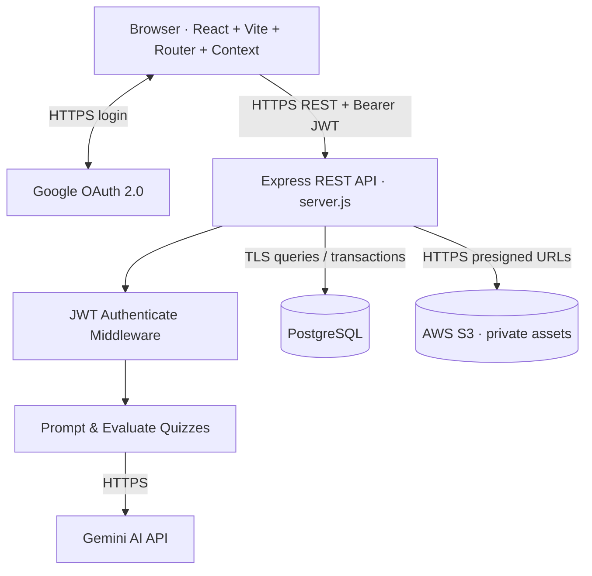

# Quiz Platform

โครงสร้างแยกเป็น React SPA (`client`) และ Express REST API (`server`) ตาม architecture ที่กำหนด โดยไม่อิง stack ที่ปรากฏในภาพตัวอย่าง



## Flow

1. Browser รับ Google ID token ผ่าน Google Identity Services
2. `POST /api/auth/google` ตรวจ token กับ Google แล้วออก application JWT อายุ 1 ชั่วโมง
3. Client เก็บ JWT และแนบ `Authorization: Bearer <token>` ทุก protected request
4. Middleware ตรวจ JWT ก่อน quiz/upload routes
5. Backend เท่านั้นที่เรียก Gemini, PostgreSQL และ S3

## เริ่มใช้งาน

```bash
cp .env.example server/.env
cp .env.example client/.env
npm install
psql "$DATABASE_URL" -f server/sql/001_initial.sql
npm run dev
```

ใน production ให้ TLS termination อยู่ที่ load balancer/reverse proxy และตั้ง `NODE_ENV=production`; API จะปฏิเสธ request ที่ proxy ไม่ระบุว่าเป็น HTTPS. S3 bucket ควรเป็น private และอนุญาตเฉพาะ presigned URL.

## API

- `POST /api/auth/google` public — exchange Google credential เป็น JWT
- `GET /api/auth/me` protected
- `POST /api/quizzes/generate` protected
- `POST /api/quizzes/:id/evaluate` protected
- `POST /api/uploads/presign` protected
- `POST /api/uploads/access` protected
